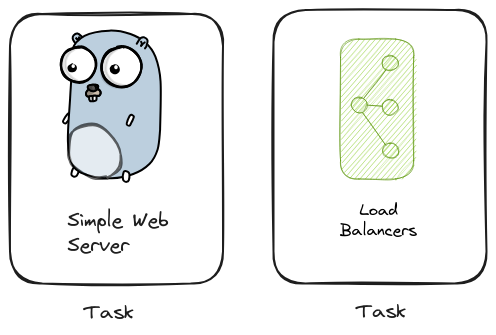
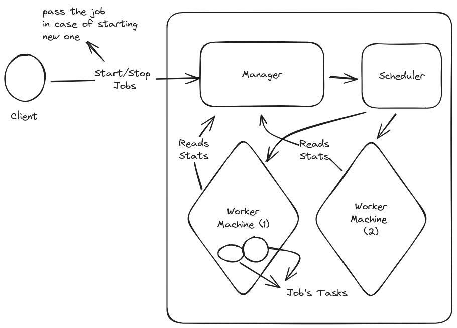
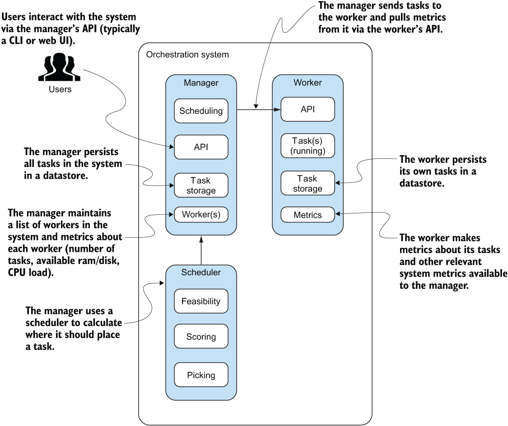

# Components of the system: 
## 1. Task 
- The task is any program or application we need to deploy.

## 2. Job
- The job is one or set of tasks we need to manage, its the definition of the task/s
- Task and Job in kubernetes terms are called objects

## 3. Scheduler 
- Scheduler decide which machine our task will get deployed on 
    - specify list of candidate machines
    - score the machines, and decide the machine based on the score

## 4. Manager
- The brain of the orchestrator 
- known as `control plane` in k8s terms

## 5. Worker 
- Worker is the machine where we run our program as a container (docker container)
- Know as `Kubelet` in k8s terms

## In-Depth architecture 
